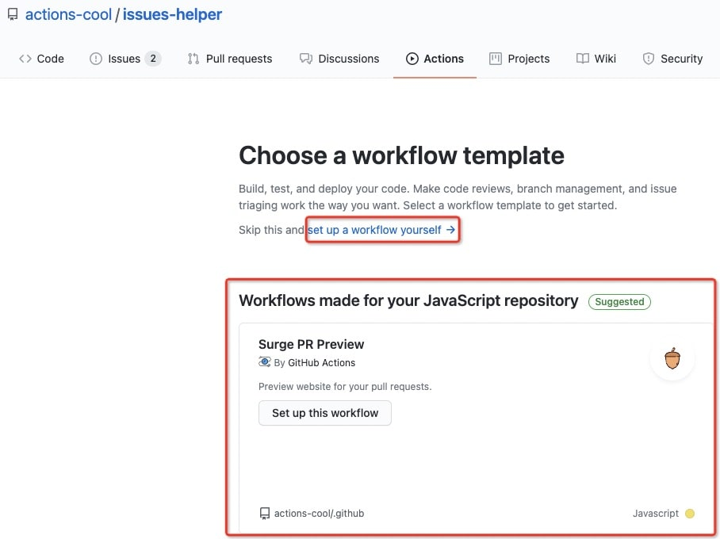

## 快速开始

### 1. 新建 Action

点击仓库的 Actions，若已增加过 Actions，会显示如下界面。


点击 `New workflow` 新增。



<Alert type="success">
你可以点击 <Badge>set up a workflow yourself</Badge> 新增一个自定义 action，也可以根据模板来套用新增一个 action。<a target="_blank" href="https://github.com/actions-cool/.github">模板使用</a>。
</Alert>

### 2. 编写 Action

Actions 存放地址是固定的，统一为 `/.github/workflows/xx.yml`。

下面拿首页的例子详细说明下。对应场景为：当一个 issue 新增 `help wanted` 标签时，系统会自动进行评论。

```yml
name: Issue Reply

on:
  issues:
    types: [labeled]

jobs:
  reply-helper:
    runs-on: ubuntu-latest
    steps:
      - name: help wanted
        if: github.event.label.name == 'help wanted'
        uses: actions-cool/issues-helper@1.x
        with:
          actions: 'create-comment'
          token: ${{ secrets.GITHUB_TOKEN }}
          issue-number: ${{ github.event.issue.number }}
          body: |
            Hello @${{ github.event.issue.user.login }}. We totally like your proposal/feedback, welcome PR。

            你好 @${{ github.event.issue.user.login }}，我们完全同意你的提议/反馈，欢迎PR。
```
- `YML` 语法参考
  - [GitHub Actions 语法](https://docs.github.com/en/free-pro-team@latest/actions/reference/workflow-syntax-for-github-actions#on)
- `name`：workflow 名称
  - Actions 流程名称，可根据实际情况自定义
- `on`：action 触发条件
  - 参考 [工作流触发机制](https://docs.github.com/en/free-pro-team@latest/actions/reference/events-that-trigger-workflows)
- `uses`：使用 actions 名称
  - `uses: actions-cool/issues-helper@1.x`。版本选择请 [参考](/changelog)
- `issues-hepler` 参数
  - `actions`：使用功能的名称，**必填**。支持多个，需用逗号隔开，如 `create-comment,close-issue` 表示评论和关闭 issue
  - `token`：需拥有 push 权限的人员 token
    - 更多 [参考](/guide/ref#-token-说明)
  - `issue-number`：传入参数，这里表示当前 issue 的编号。如果你对写法疑惑，可 [查看](https://docs.github.com/en/free-pro-team@latest/actions/reference/context-and-expression-syntax-for-github-actions#github-context)
  - `body`：传入参数，这里表示当前进行评论的内容

### 3. 启用 Action

当你完成编写完成提交到主分支后，即可自动启用该 workflow，触发条件遵循 `on` 的定义。

😏 相信到这里你已经对 `如何使用` 有了大概的了解，是不是想快点尝试一下。

下面请在 [基 础](/base) 和 [进 阶](/advanced) 查看你需要的功能，灵活参考。
